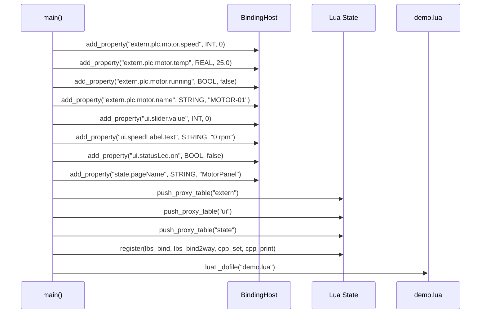
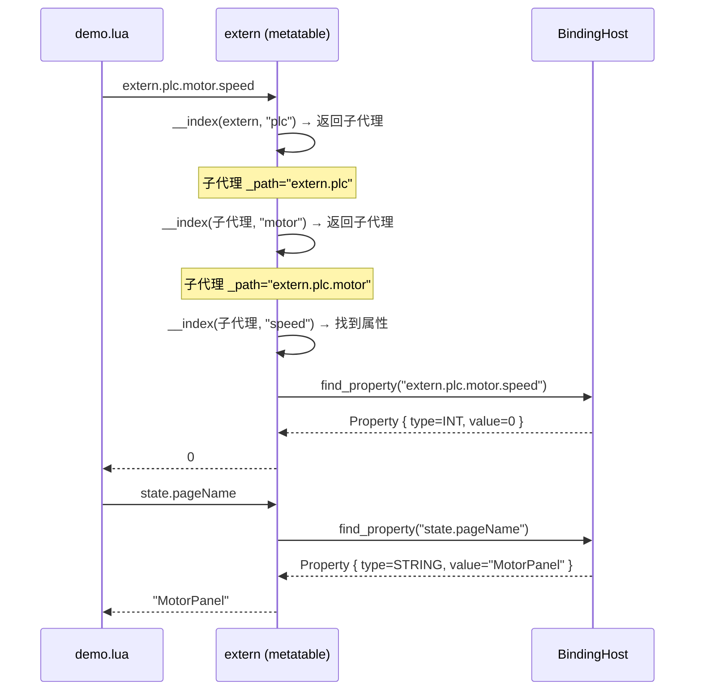
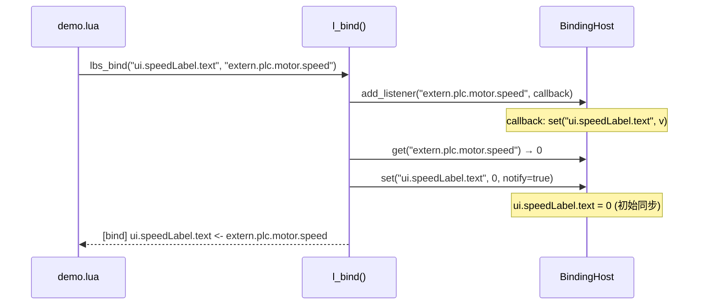
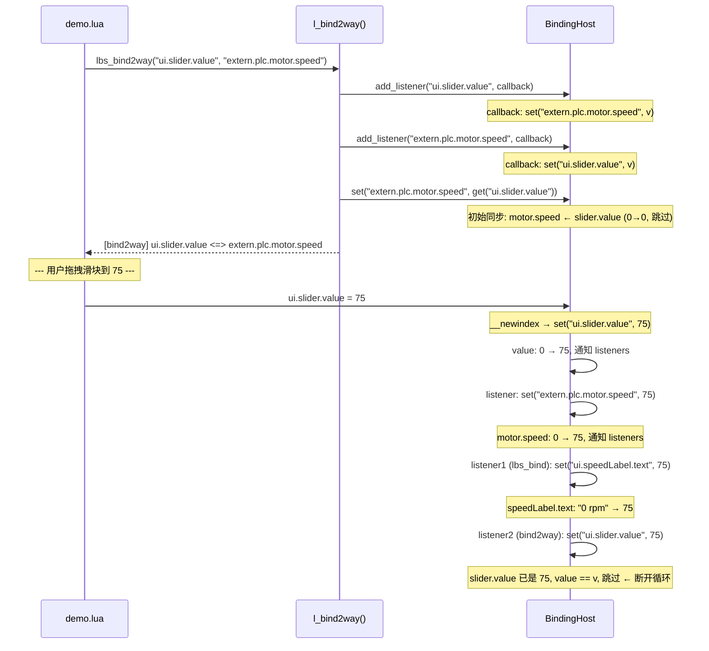
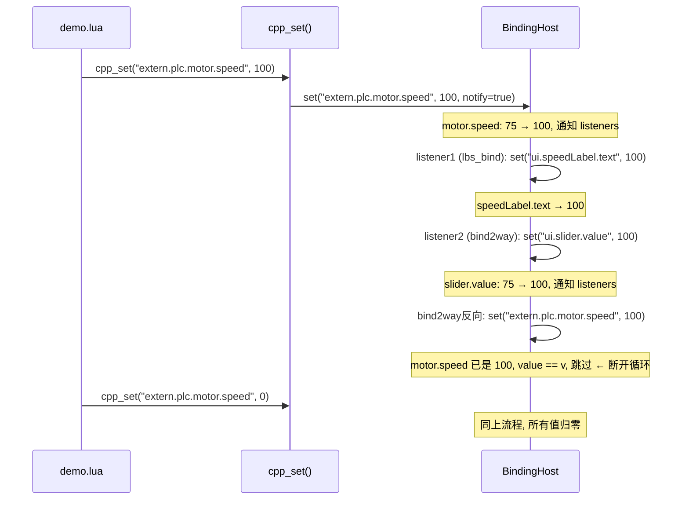
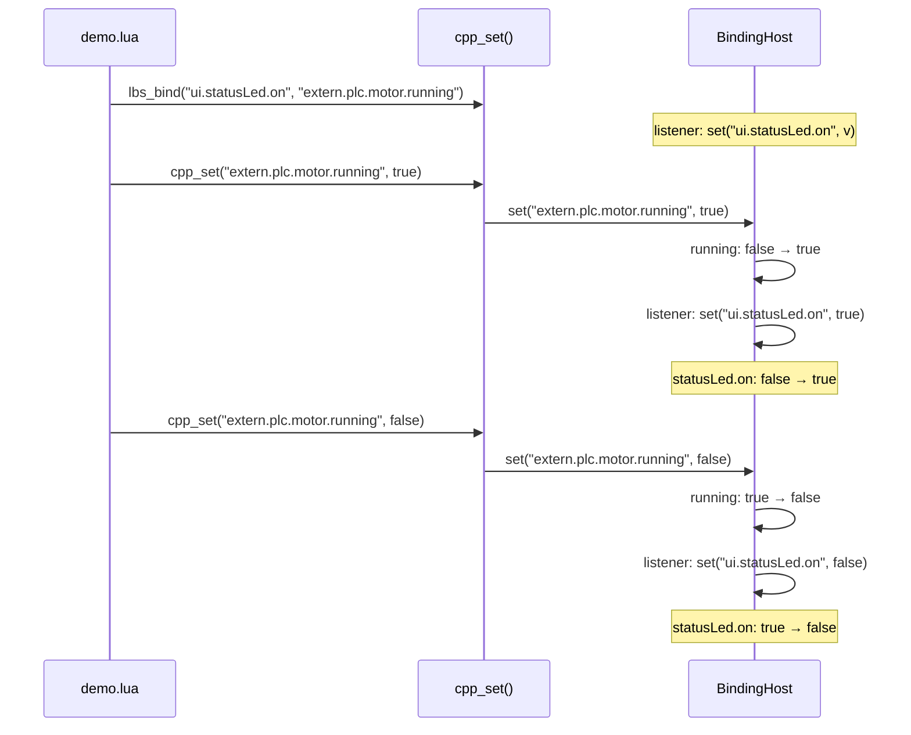
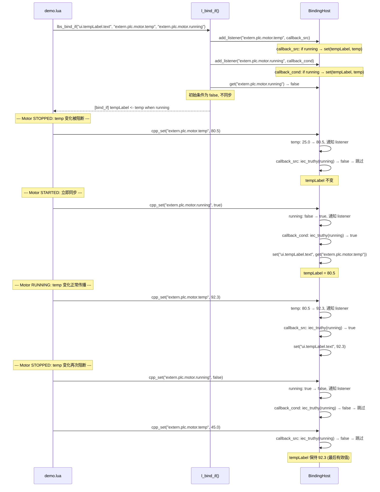
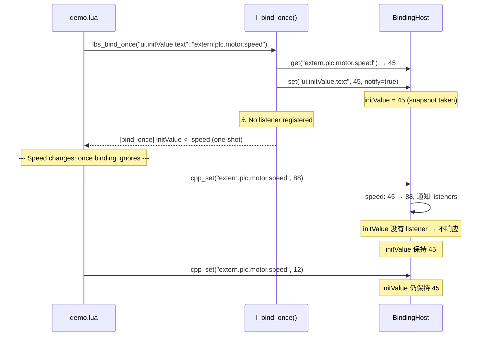
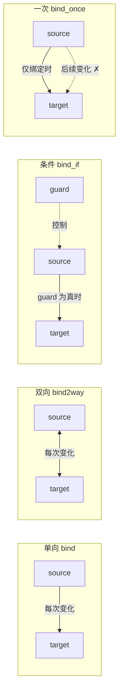

# C++/Lua 双向绑定 Demo — 时序图

## 1. 初始化阶段



## 2. 读取属性（Lua → C++）



## 3. 单向绑定（lbs_bind）



## 4. 双向绑定（lbs_bind2way）+ 用户操作



## 5. PLC 值变化（C++ → Lua）



## 6. 布尔类型绑定



## 7. 条件绑定（lbs_bind_if）— 仅当 guard 为真时生效



## 8. LBS 语法中的条件绑定

```lua
-- 条件单向绑定 (LBS 扩展语法)
bind ui.tempLabel.text <- extern.plc.motor.temp when extern.plc.motor.running

-- 等价 Demo API
lbs_bind_if("ui.tempLabel.text", "extern.plc.motor.temp", "extern.plc.motor.running")
```

`LBS_BindDecl` 新增字段:

| 字段 | 类型 | 说明 |
|------|------|------|
| `condition` | `LBS_BindPath *` | 守卫路径，NULL 表示无条件 |

## 9. Once 绑定（lbs_bind_once）— Vue v-once 语义



## 10. 四种绑定模式对比

| 模式 | LBS 语法 | Demo API | 更新时机 |
|------|---------|----------|---------|
| 单向 | `bind A <- B` | `lbs_bind` | B 每次变化 → A |
| 双向 | `bind A <=> B` | `lbs_bind2way` | 任一侧变化 → 另一侧 |
| 条件 | `bind A <- B when C` | `lbs_bind_if` | B 变化 + C 为真 → A |
| 一次 | `bind A <- B once` | `lbs_bind_once` | **仅绑定时一次** → A |



## 11. 整体依赖图

```mermaid
graph TD
    subgraph "C++ BindingHost"
        P1["extern.plc.motor.speed<br/>(INT)"]
        P2["extern.plc.motor.temp<br/>(REAL)"]
        P3["extern.plc.motor.running<br/>(BOOL)"]
        P4["extern.plc.motor.name<br/>(STRING)"]
        U1["ui.slider.value<br/>(INT)"]
        U2["ui.speedLabel.text<br/>(STRING)"]
        U3["ui.statusLed.on<br/>(BOOL)"]
        U4["ui.tempLabel.text<br/>(STRING)"]
        U5["ui.initValue.text<br/>(STRING)"]
        S1["state.pageName<br/>(STRING)"]
    end

    subgraph "Lua Proxy"
        EXT["extern"]
        UI["ui"]
        ST["state"]
    end

    EXT -.->|__index / __newindex| P1
    EXT -.->|__index / __newindex| P2
    EXT -.->|__index / __newindex| P3
    EXT -.->|__index / __newindex| P4
    UI  -.->|__index / __newindex| U1
    UI  -.->|__index / __newindex| U2
    UI  -.->|__index / __newindex| U3
    ST  -.->|__index / __newindex| S1

    P1 -->|lbs_bind| U2
    P1 <-->|lbs_bind2way| U1
    P3 -->|lbs_bind| U3
    P2 -->|lbs_bind_if<br/>when P3| U4["ui.tempLabel.text<br/>(STRING)"]
    P1 -->|lbs_bind_once<br/>(one-shot)| U5

    style P1 fill:#f96,stroke:#333
    style U1 fill:#f96,stroke:#333
    style U2 fill:#9cf,stroke:#333
    style U3 fill:#9f6,stroke:#333
    style P3 fill:#9f6,stroke:#333
    style P2 fill:#ff9,stroke:#333
    style U4 fill:#ff9,stroke:#333
```

| 图例 | 含义 |
|------|------|
| 🟠 橙色 | 双向绑定节点（`<=>`） |
| 🔵 蓝色 | 单向绑定 target（`<-`） |
| 🟢 绿色 | 单向绑定 source → target |
| 🟡 黄色 | 条件绑定（`when` 守卫） |
| ⬜ 灰色 | 一次绑定（`once` 快照） |
