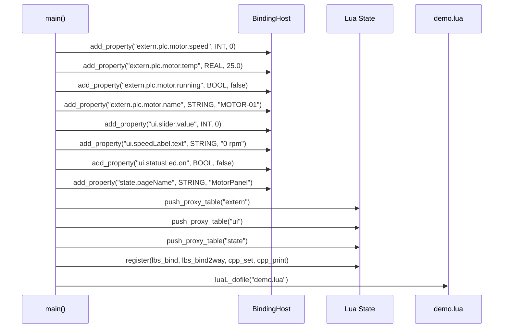
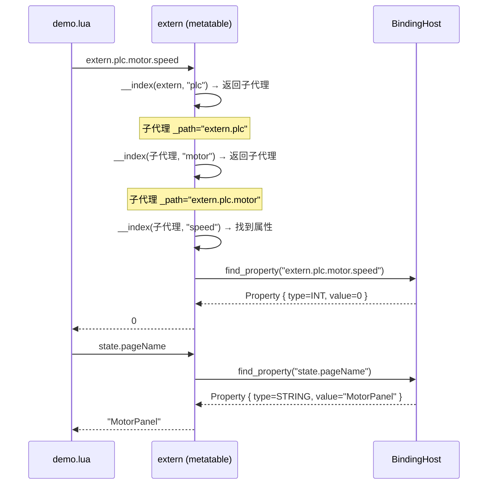
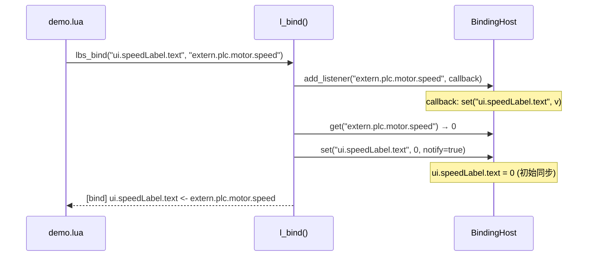
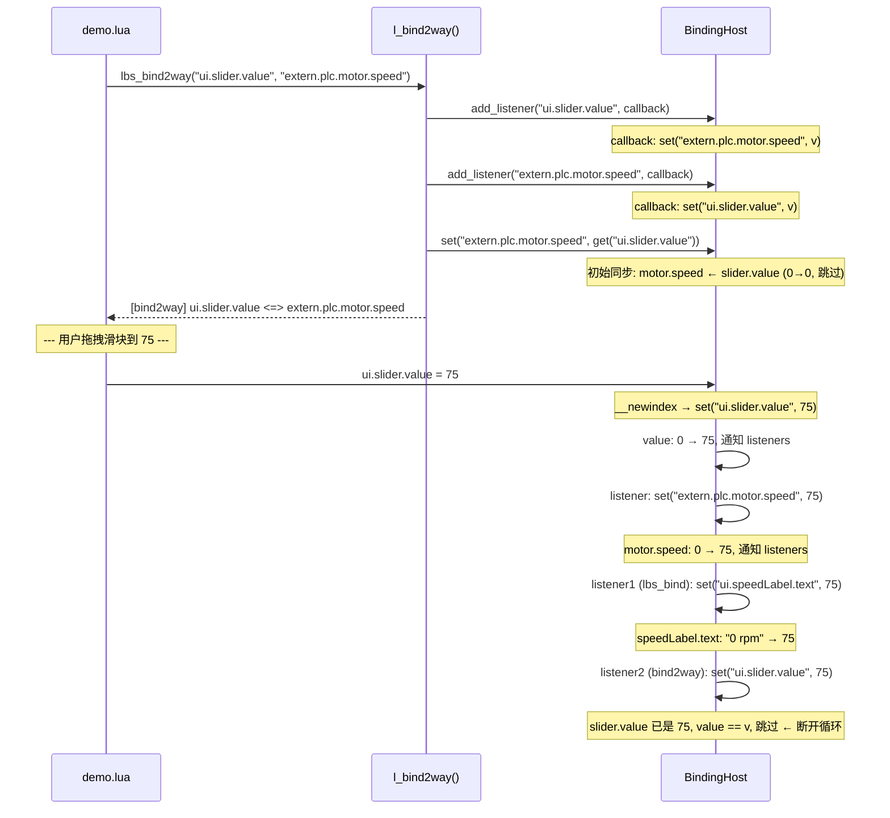
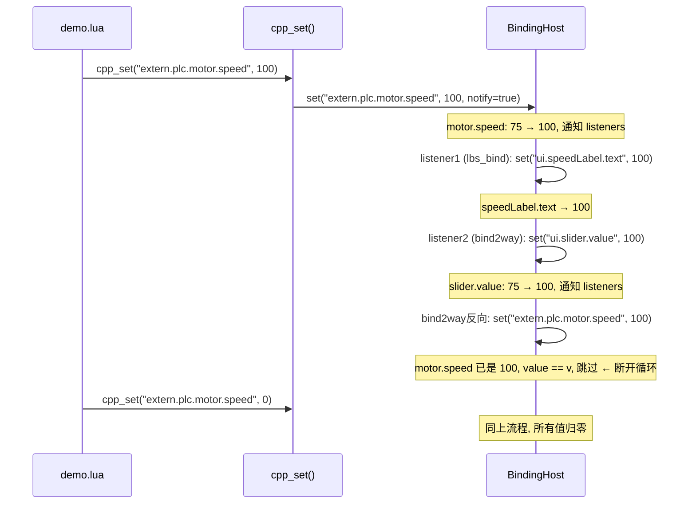
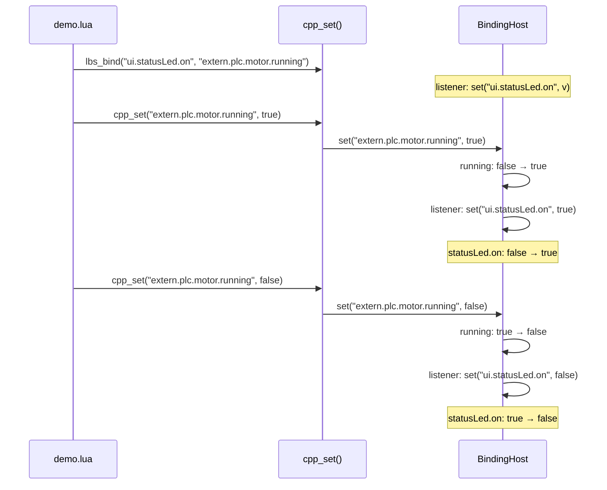
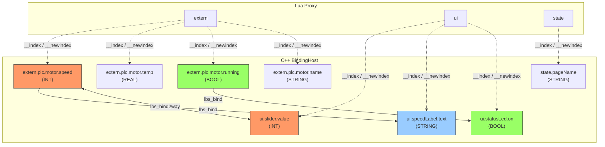

# C++/Lua 双向绑定 Demo — 时序图

## 1. 初始化阶段

## 2. 读取属性（Lua → C++）

## 3. 单向绑定（lbs_bind）

## 4. 双向绑定（lbs_bind2way）+ 用户操作

## 5. PLC 值变化（C++ → Lua）

## 6. 布尔类型绑定

## 7. 整体依赖图

| 图例 | 含义 |
|------|------|
| 🟠 橙色 | 双向绑定节点（`<=>`） |
| 🔵 蓝色 | 单向绑定 target（`<-`） |
| 🟢 绿色 | 单向绑定 source → target |
